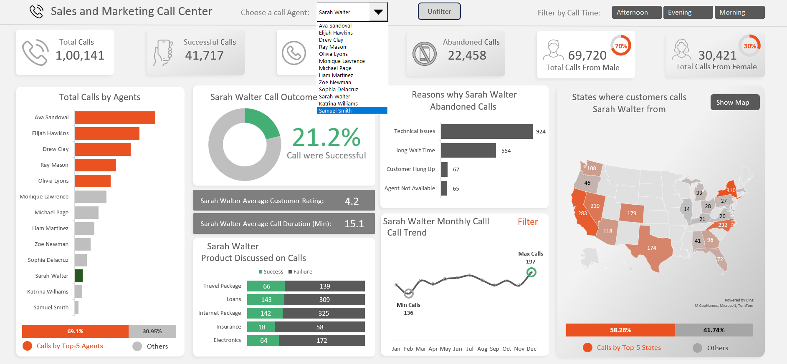

# Sales & Marketing Call Center Analysis Dashboard

## Dashboard Preview

### Overall Dashboard

---

## Project Overview
This project analyzes call center performance using a real-world dataset of **100,000+ call records**.
The objective is to evaluate agent performance, call outcomes, customer behavior, and reasons for call abandonment
through an interactive Excel dashboard.

---

## Dataset Summary
- Total Records: 100,000+ calls
- Data Type: Call center operational data
- Level: Individual call-level data

### Columns Used
- Call_ID, Date  
- Agent Full Name, Agent Rating  
- Product_Discussed  
- Call_Duration_Minutes  
- Call_Outcome (Success / Failure / Abandoned)  
- Customer_Gender, State, Customer_Age  
- Time_of_Day  
- Reason_Call_Abandoned  

---

## Business Questions Answered
- What are the success, failure, and abandonment rates of calls?
- Which agents handle the highest number of calls?
- Which agents have better success rates and ratings?
- What are the major reasons behind abandoned calls?
- Which products perform better in successful calls?
- How do call volumes change month-wise?
- Which states generate the highest call volume?

---

## Tools & Techniques Used
- Microsoft Excel  
  - Pivot Tables  
  - Calculated Fields  
  - Charts & Slicers  
- Dashboard Design  
  - KPI cards  
  - Agent-wise analysis  
  - Product & region insights  

---

## Dashboard Highlights
- Agent-wise call performance comparison
- Success vs Failure vs Abandoned call analysis
- Product-wise success and failure distribution
- Monthly call trend analysis
- State-wise call distribution map
- Gender-based call insights

---

## Key Insights
- A small group of top agents handles the majority of total calls.
- Technical issues and long wait times are the main causes of call abandonment.
- Some products have high call volume but low success rate.
- Agent performance varies significantly, impacting overall success rate.

---

## Conclusion
This project demonstrates how large-scale operational data can be transformed into meaningful business insights
using Excel dashboards, helping decision-makers improve efficiency and reduce call abandonment.

---

## Contact  
**Email:** ishantkatiyar68@gmail.com  
**LinkedIn:** https://www.linkedin.com/in/ishantkatiyar/
